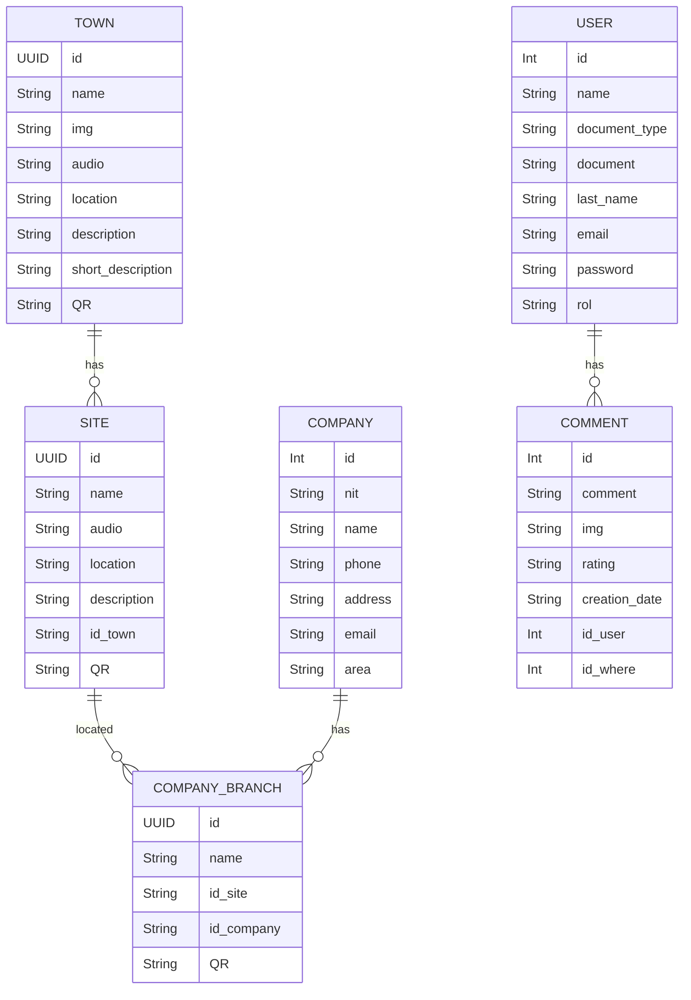
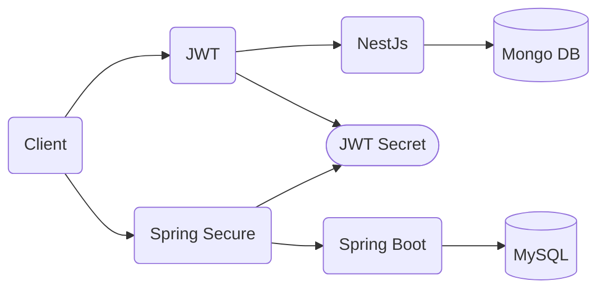

# Querer-touR

QuerertouR es una guía interactiva para explorar los pueblos y sitios de interés del departamento de Antioquia, Colombia. Dirigido a turistas y residentes, ofrece información detallada para planificar y disfrutar de experiencias turísticas locales de manera fácil y eficiente.

## Nuestro propósito

QuerertouR nace de la necesidad de brindar visibilidad a los pueblos del departamento de Antioquia y algunos sitios de interés de Medellín de una manera diferente, ya que utiliza puntos físicos estratégicos para acceder a la información de dichos lugares. 
Como estrategia para cumplir dicho objetivo, inicialmente, el primer acercamiento al aplicativo se da por medio de los códigos QR ubicados en las principales terminales aéreas de Antioquia y en las terminales terrestres de los pueblos del departamento de Antioquia. También habrá un QR diferente al de las terminales, ubicado en el parque principal de cada pueblo del departamento de Antioquia y en los sitios de interés que ofrece la aplicación.
Además de ofrecer visibilidad de dichos lugares, se busca  fomentar el comercio local de los pequeños negocios y emprendimientos locales poco conocidos que se encuentran en los pueblos del departamento de Antioquia

## Nuestro Objetivo

QuerertouR tiene como objetivo ser una ayuda y/o guía interactiva tanto para los turistas nacionales e internacionales como para los habitantes locales que tienen interés en visitar los pueblos del departamento de Antioquia con sus respectivos sitios de interés y algunos sitios de la ciudad de Medellín, y de esta manera, promover el turismo cultural, ecológico y social.
Además, busca brindar visibilidad de los comercios locales poco conocidos en los pueblos del departamento de Antioquia, fomentando así el comercio local.

## Para quién estamos creando valor

En primera instancia la aplicación web está dirigida a turistas nacionales e internacionales, pero también será de utilidad para los habitantes locales para obtener información y sitios de interés acerca de los pueblos del departamento de Antioquia.

## Integrantes

- Carolina Garcia
- Santiago Echeverry
- Alejandro Duque
- Darwing Mosquera

## Paso a Paso 

### 1. Configuración Base de Datos

> [!WARNING]
> Asegurate de tener instalado y activado el XAMPP 

Usa Workbench o tu entorno preferido para crear la base de datos, y escribe el siguiente comando:

```MySql
CREATE DATABASE querertour_api_db;
```

### 2. Configuración del proyecto en local

> [!WARNING]
> Asegurate de tener instalado git

Abre la consola y escribe los siguientes comandos

- Configuración del nombre y correo en git

```Git
git config --global user.name "Tu nombre"
git config --global user.email "Tu email"
```

- Navega a la carpeta donde deseas guardar el proyecto

```
cd ruta/donde/quieras/clonar
```

- Clonar el repositorio
```Git
git clone https://github.com/Alduk3/Querer-touR-SpringBoot.git
```

- Acceder a la carpeta del proyecto
```
cd Querer-touR-SpringBoot
```

- Navega a la rama de develop
```Git
git checkout develop
```

- Crear rama de trabajo feature
```Git
git branch feature/#-nombre-tarea
```

- Moverse a la rama
```Git
git checkout nombre-rama-trabajo
```

- Subir cambios primera vez
```Git
git push -u origin nombre-rama-trabajo
```

Luego puedes subirlo solo con ```git push```

Recuerda hacer el pull request para conectarla a la develop

## Modelo o diseño del proyecto

### Modelo Base de Datos


### Modelo UML de clases

> [!Note]
> Se agregara una vez se termine el trabajo

### Modelo Arquitectura de componentes


#### Arquitectura de microservicios


#### Arquitectura Hexagonal
##### NestJs
```Markdown
src/
 ├── app/
 │ ├── module/
 │ │ ├── application/
 │ │ │ ├── command/
 │ │ │ ├── query/
 │ │ │ └── handler/
 │ │ ├── domain/
 │ │ │ ├── model/
 │ │ │ ├── service/
 │ │ │ └── repository/
 │ │ └── infrastructure/
 │ │ ├── repository/
 │ │ └── config/
 │ └── shared/
 │ └── utils/
 └── main.ts
```

##### Spring Boot
```Markdown
src/
└── main/
   ├── java/
   │   └── com/
   │       └── riwi/
   │           └── querer-tour/
   │               ├── querer-tourApp.java
   │               ├── domain/
   │               │   ├── entities/
   │               │   └── repositories/
   │               ├── api/
   │               │   ├── controllers/
   │               │   ├── dto/
   │               │   └── error_handler/
   │               ├── infrastructure/
   │               │   ├── abstract_services/
   │               │   ├── services/
   │               │   └── helpers/
   │               ├── util/
   │               │   ├── enums/
   │               │   └── exceptions/
   │               └── config/
   └── resources/
      ├── application.properties
      ├── configs/
      └── email/
```

## Levantamiento de Requisitos

> [!Note]
> Se tiene en documento, falta agregar al README

## Tablero de gestion de proyectos

Como equipo decidimos usar Notion como gestor de proyecto [Tablero](https://notion.io)

## Documentación de los endpoints (Swagger)

> [!Note]
> Se agregara una vez se termine el trabajo